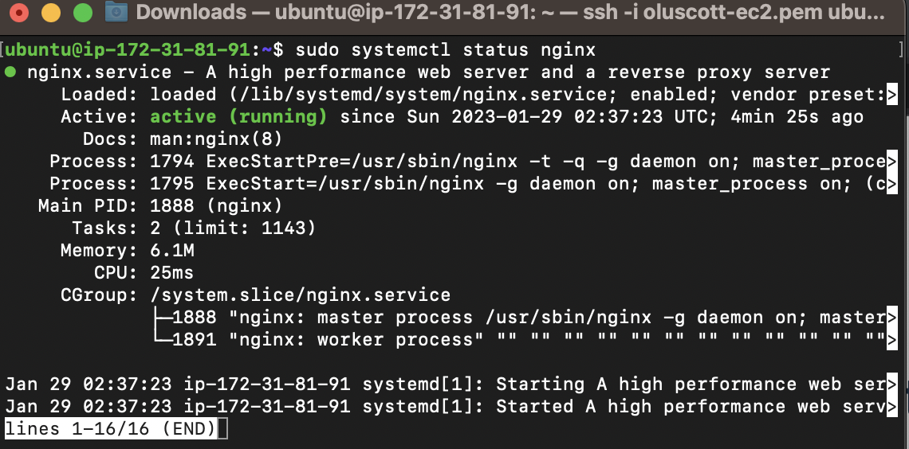

## LEMP STACK IMPLEMENTATION

### **create a new instance for project 2 and ssh into the instance**

### **INSTALLING THE NGINX WEB SERVER**

`sudo apt update`

`sudo apt install nginx`

`sudo systemctl status nginx`

#### **Welcome to nginx**

### **INSTALLING MYSQL**

`sudo apt install mysql-server`

`sudo mysql`

`sudo mysql_secure_installation`

**Test if you’re able to log in to the MySQL console by typing**

`sudo mysql -p`

.[Database management system](https://en.wikipedia.org/wiki/Database#Database_management_system)

.[Relational database](https://en.wikipedia.org/wiki/Relational_database)

### **INSTALLING PHP**

`sudo apt install php-fpm php-mysql`

**Below screenshot shows the PHP version installed**

.[PHP](https://www.php.net/)
